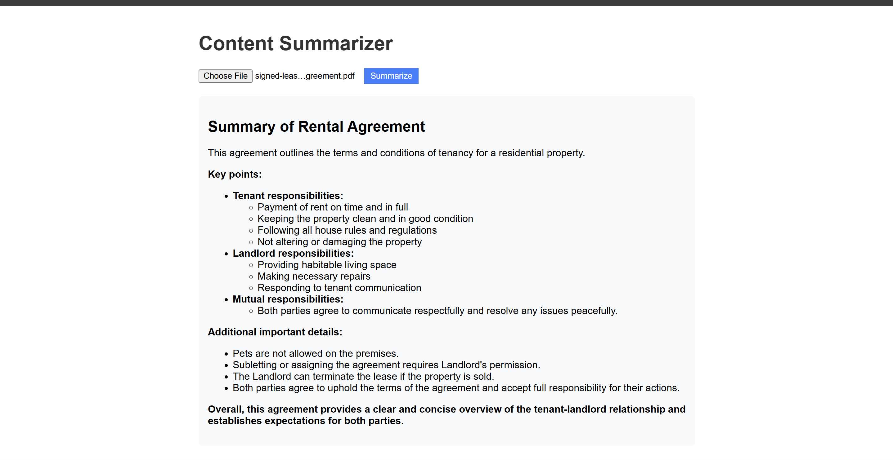

# content-summarizer (AI-Powered PDF Summarizer)

This project is an AI-powered PDF summarizer that uses Flask and Ollama to create concise, markdown-formatted summaries of uploaded PDF documents.



## Prerequisites

Before you begin, ensure you have the following installed:

- Python 3.7 or higher
- pip (Python package manager)
- Ollama (for running local AI models)

## Setup Instructions

1. Install the required packages:
```
pip install -r requirements.txt
```
2. Pull the Gemma model using Ollama:
```
ollama pull gemma
```
3. Run the Flask application:
```
python app.py
```

## Usage

1. Upload a PDF file using the web interface.
2. Click the "Summarize" button.
3. Wait for the AI to process and summarize the document.
4. View the markdown-formatted summary on the page.

## Project Outcome

This project demonstrates the following capabilities:

1. **PDF Processing**: Extracts text from uploaded PDF files.
2. **AI-Powered Summarization**: Uses the Gemma model through Ollama to generate concise summaries.
3. **Markdown Formatting**: Presents summaries in a structured, easy-to-read markdown format.
4. **Caching**: Stores generated summaries to avoid redundant processing of the same document.
5. **Web Interface**: Provides a simple, user-friendly interface for document upload and summary display.

## Technologies Used

- Flask: Web framework for the backend
- PyPDF2: PDF processing library
- Ollama: Interface for running local AI models
- Marked.js: Client-side markdown rendering


## Contributing

Contributions are welcome! Please feel free to submit a Pull Request.

## License

This project is licensed under the Apache License - see the [LICENSE](LICENSE) file for details.